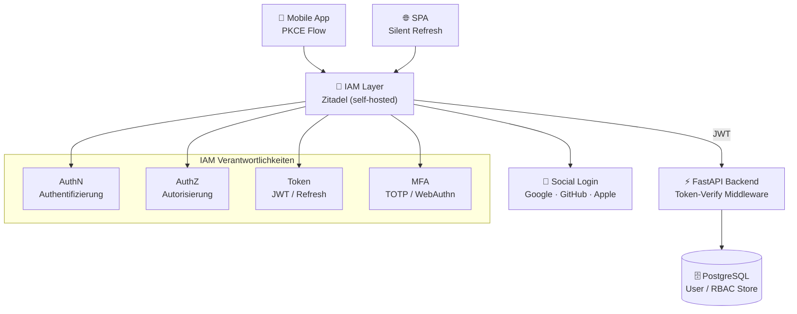
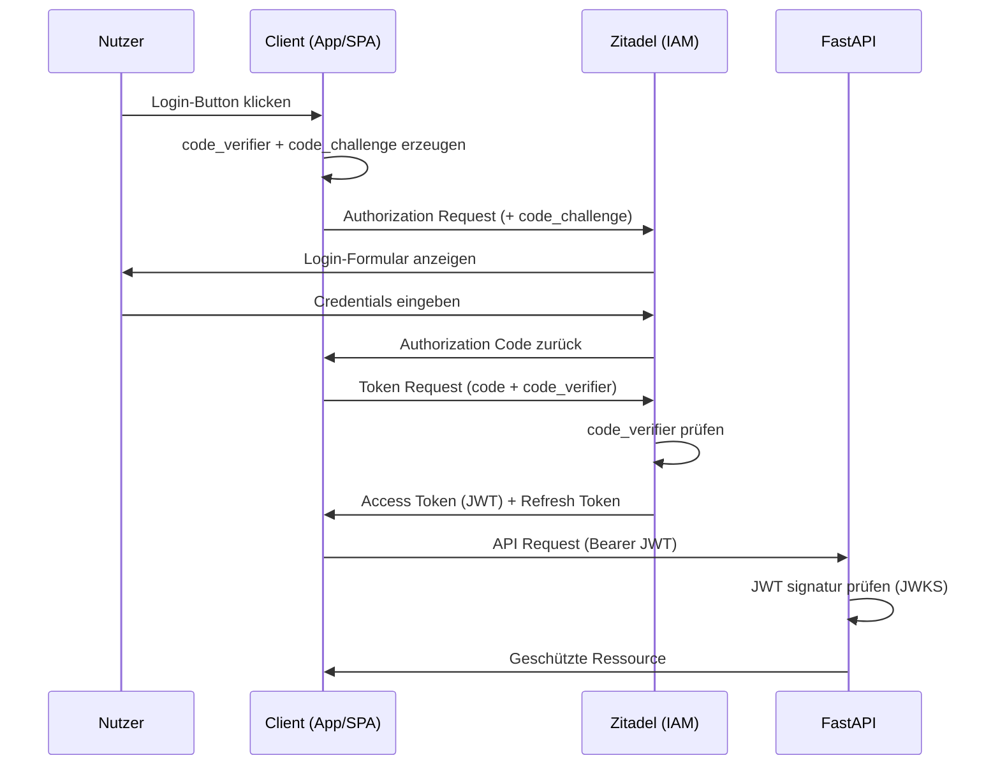
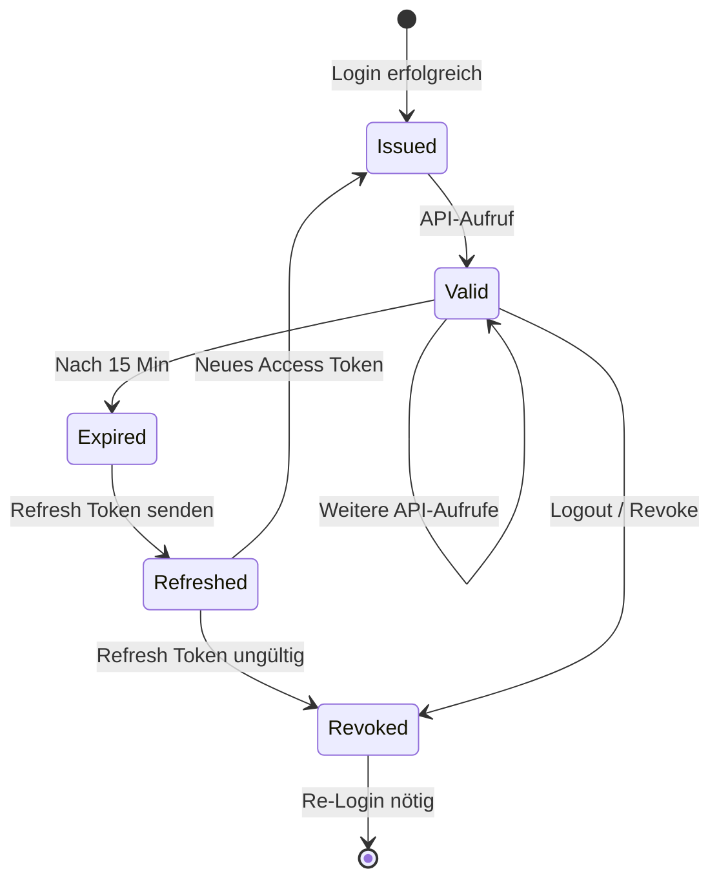
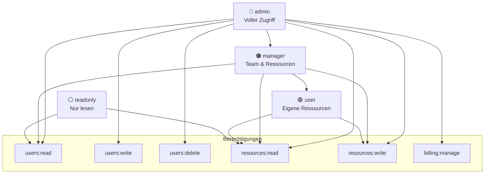
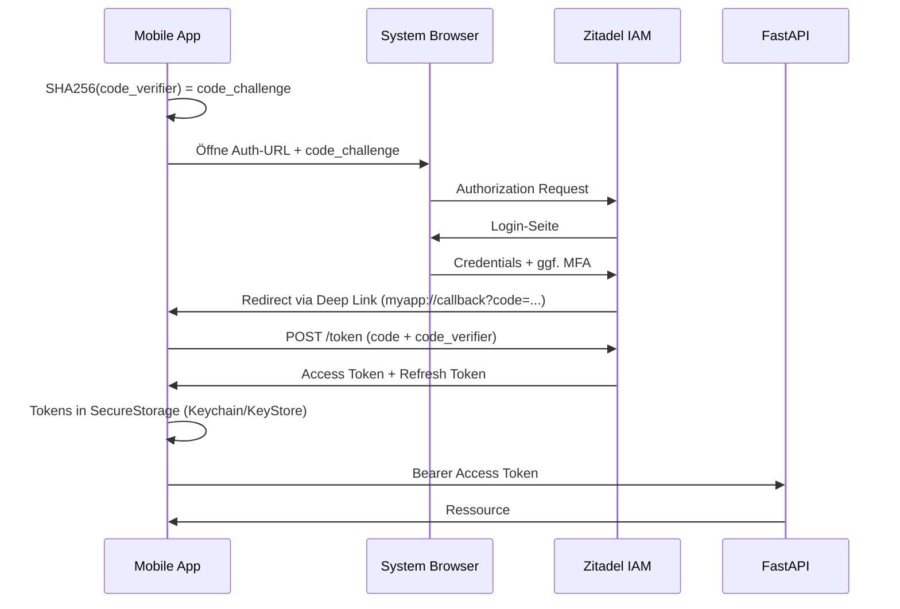
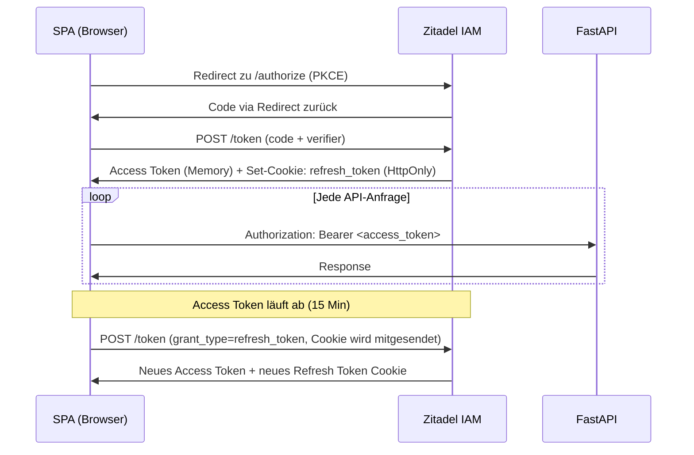
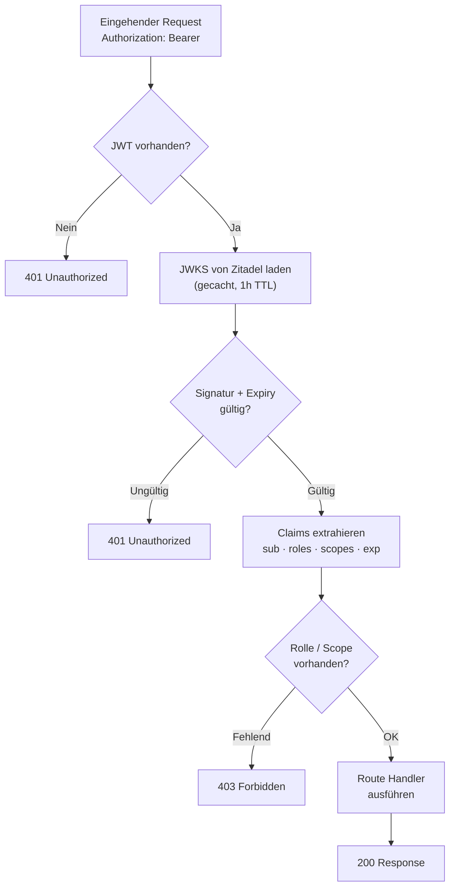
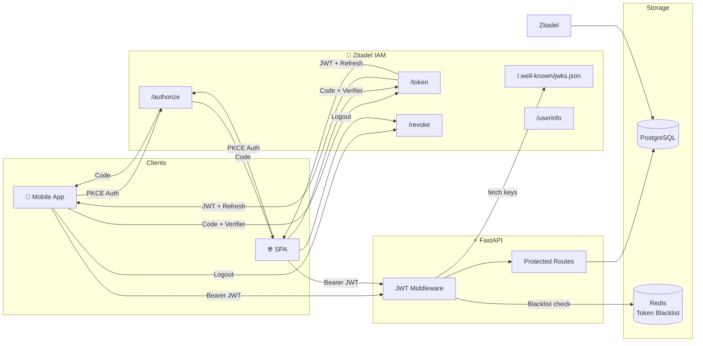
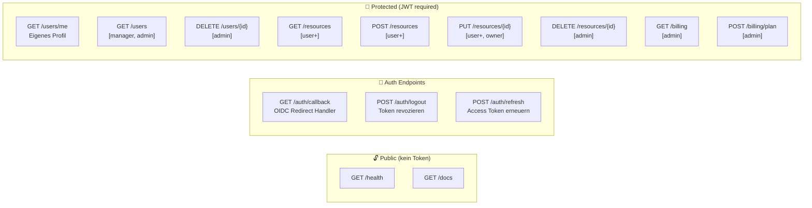

# Architecture Decision Records — IAM / Authentication & Authorization

> Dieses Dokument enthält alle relevanten Architekturentscheidungen (ADRs) für das Identity & Access Management der SaaS-Plattform.  
> Stack: **Python FastAPI** · **Mobile App (iOS/Android)** · **SPA (Web)**

---

## Inhaltsverzeichnis

- [Übersicht](#übersicht)
- [ADR-Liste](#adr-liste)
  - [ADR-001 — IAM-Strategie & Lösungsauswahl](#adr-001--iam-strategie--lösungsauswahl)
  - [ADR-002 — Authentifizierungsprotokoll (OAuth 2.0 + OIDC)](#adr-002--authentifizierungsprotokoll-oauth-20--oidc)
  - [ADR-003 — Token-Strategie (JWT + Refresh Token Rotation)](#adr-003--token-strategie-jwt--refresh-token-rotation)
  - [ADR-004 — Autorisierungsmodell (RBAC)](#adr-004--autorisierungsmodell-rbac)
  - [ADR-005 — Mobile Auth Flow (PKCE)](#adr-005--mobile-auth-flow-pkce)
  - [ADR-006 — SPA Auth Flow (Silent Refresh)](#adr-006--spa-auth-flow-silent-refresh)
  - [ADR-007 — FastAPI Integration (Dependency Injection)](#adr-007--fastapi-integration-dependency-injection)
- [Auth-Flow Diagramme](#auth-flow-diagramme)
- [API Endpoints Übersicht](#api-endpoints-übersicht)
- [Status-Legende](#status-legende)

---

## Übersicht



---

## ADR-Liste

| Nr. | Titel | Status | Datum | Entscheider |
|-----|-------|--------|-------|-------------|
| [ADR-001](#adr-001--iam-strategie--lösungsauswahl) | IAM-Strategie & Lösungsauswahl | ✅ Accepted | 2025-01-01 | Architektur-Team |
| [ADR-002](#adr-002--authentifizierungsprotokoll-oauth-20--oidc) | Authentifizierungsprotokoll | ✅ Accepted | 2025-01-01 | Architektur-Team |
| [ADR-003](#adr-003--token-strategie-jwt--refresh-token-rotation) | Token-Strategie | ✅ Accepted | 2025-01-01 | Architektur-Team |
| [ADR-004](#adr-004--autorisierungsmodell-rbac) | Autorisierungsmodell (RBAC) | ✅ Accepted | 2025-01-01 | Architektur-Team |
| [ADR-005](#adr-005--mobile-auth-flow-pkce) | Mobile Auth Flow (PKCE) | ✅ Accepted | 2025-01-01 | Mobile-Team |
| [ADR-006](#adr-006--spa-auth-flow-silent-refresh) | SPA Auth Flow | ✅ Accepted | 2025-01-01 | Frontend-Team |
| [ADR-007](#adr-007--fastapi-integration-dependency-injection) | FastAPI Integration | ✅ Accepted | 2025-01-01 | Backend-Team |

---

## ADR-001 — IAM-Strategie & Lösungsauswahl

**Status:** ✅ Accepted

### Kontext

Die SaaS-Plattform benötigt ein IAM-System das:
- Mobile Apps (iOS/Android) mit PKCE absichert
- Eine SPA mit sicherem Token-Handling versorgt
- Das FastAPI-Backend über JWT-Middleware schützt
- RBAC für Benutzerrollen abbildet
- DSGVO-konform und self-hosted betreibbar ist

### Bewertete Optionen

| Option | Typ | Ops-Aufwand | Kosten bei Skala | Datensouveränität |
|--------|-----|-------------|-----------------|-------------------|
| Auth0 | Managed SaaS | 🟢 Gering | 🔴 Hoch | 🔴 Extern |
| Clerk | Managed SaaS | 🟢 Gering | 🔴 Hoch | 🔴 Extern |
| Supabase Auth | Managed / OSS | 🟢 Gering | 🟡 Mittel | 🟡 Optional self-host |
| **Zitadel** | **Self-hosted OSS** | **🟡 Mittel** | **🟢 Kostenlos** | **🟢 Vollständig** |
| Keycloak | Self-hosted OSS | 🔴 Hoch | 🟢 Kostenlos | 🟢 Vollständig |
| Eigener Stack | Custom | 🟢 Gering | 🟢 Kostenlos | 🟢 Vollständig |

### Entscheidung

**Zitadel** wird als IAM-Lösung eingesetzt.

### Begründung

- Go-basiert: deutlich ressourceneffizienter als Keycloak (Java)
- Volle OAuth2/OIDC-Unterstützung mit PKCE nativ
- Multi-Tenancy out-of-the-box
- Aktive Weiterentwicklung (2024/2025)
- Self-hosted → vollständige DSGVO-Konformität ohne Datenweitergabe
- REST-API für Verwaltungsaufgaben vorhanden
- Optionale SaaS-Migration (Zitadel Cloud) jederzeit möglich

### Konsequenzen

- Zitadel wird per Docker Compose oder Kubernetes betrieben
- PostgreSQL als Datenbankbackend für Zitadel
- Ramp-up ca. 1 Woche für initiales Setup und FastAPI-Integration

---

## ADR-002 — Authentifizierungsprotokoll (OAuth 2.0 + OIDC)

**Status:** ✅ Accepted

### Kontext

Sowohl Mobile als auch SPA brauchen einen sicheren, standardisierten Login-Flow. Social Login (Google, GitHub, Apple) ist gewünscht.

### Entscheidung

**OAuth 2.0 Authorization Code Flow mit PKCE** und **OpenID Connect (OIDC)** als Identitätsschicht.

### Flow-Diagramm



### Konsequenzen

- PKCE ist für Mobile **pflicht** (kein Client-Secret im App-Bundle)
- PKCE wird auch für SPA eingesetzt (Best Practice, kein implizit Flow)
- Social-Login-Provider werden in Zitadel als Identity Provider konfiguriert

---

## ADR-003 — Token-Strategie (JWT + Refresh Token Rotation)

**Status:** ✅ Accepted

### Kontext

Access Tokens müssen kurzlebig sein um Sicherheitsrisiken zu minimieren. Sessions sollen dennoch komfortabel lang laufen.

### Entscheidung

| Token | Lebensdauer | Speicherort | Erneuerung |
|-------|-------------|-------------|------------|
| Access Token (JWT) | 15 Minuten | Memory (SPA) / SecureStorage (Mobile) | via Refresh Token |
| Refresh Token | 30 Tage | HttpOnly Cookie (SPA) / SecureStorage (Mobile) | Rotation bei jedem Use |
| ID Token (OIDC) | Einmalig | Memory — nur für Profildaten | — |

### Token-Lebenszyklus



### Konsequenzen

- FastAPI verifiziert JWT via JWKS-Endpoint von Zitadel (kein Secret-Sharing nötig)
- Refresh Token Rotation: altes Refresh Token wird bei Benutzung sofort invalidiert
- Replay-Attacke auf altes Refresh Token → gesamte Session wird revoked

---

## ADR-004 — Autorisierungsmodell (RBAC)

**Status:** ✅ Accepted

### Kontext

Verschiedene Nutzergruppen benötigen unterschiedliche Zugriffsrechte auf API-Ressourcen.

### Entscheidung

**Role-Based Access Control (RBAC)** mit folgenden Rollen:



### FastAPI Implementierung

```python
# Dependency Injection Pattern
async def require_role(required_role: str):
    def checker(token: dict = Depends(verify_jwt)):
        roles = token.get("roles", [])
        if required_role not in roles:
            raise HTTPException(status_code=403)
        return token
    return checker

@router.delete("/users/{id}")
async def delete_user(
    id: str,
    _: dict = Depends(require_role("admin"))
):
    ...
```

### Konsequenzen

- Rollen werden als Custom Claims im JWT mitgeführt
- Zitadel übernimmt die Rollenverwaltung und -zuweisung
- FastAPI liest Rollen direkt aus dem verifizierten JWT — kein DB-Lookup pro Request nötig

---

## ADR-005 — Mobile Auth Flow (PKCE)

**Status:** ✅ Accepted

### Kontext

Native Mobile-Apps können kein Client-Secret sicher speichern. Der Authorization Code Flow muss ohne Secret abgesichert werden.

### Entscheidung

**Authorization Code Flow mit PKCE** über den System-Browser (ASWebAuthenticationSession / Chrome Custom Tabs). Kein Embedded WebView.

### Mobile PKCE Flow



### Konsequenzen

- Deep-Link-Schema (`myapp://`) muss pro Plattform registriert werden
- Tokens werden ausschließlich im OS-Keychain (iOS) bzw. Android Keystore gespeichert
- Biometrische Entsperrung des Keystores ist empfohlen aber optional

---

## ADR-006 — SPA Auth Flow (Silent Refresh)

**Status:** ✅ Accepted

### Kontext

Single Page Applications können kein HttpOnly-Cookie für den Authorization Code nutzen. Token-Speicherung im `localStorage` ist unsicher (XSS).

### Entscheidung

Access Token im **Memory (JS-Variable)**, Refresh Token im **HttpOnly Cookie** via Backend-for-Frontend (BFF) oder direkt per Zitadel-Session.

### SPA Flow



### Konsequenzen

- Kein Access Token in `localStorage` oder `sessionStorage`
- CSP-Header müssen korrekt gesetzt werden um XSS-Risiko zu minimieren
- SameSite=Strict auf Refresh-Token-Cookie

---

## ADR-007 — FastAPI Integration (Dependency Injection)

**Status:** ✅ Accepted

### Kontext

Das FastAPI-Backend muss jeden eingehenden Request auf einen gültigen JWT prüfen und die enthaltenen Rollen/Scopes für die Autorisierung nutzen.

### Entscheidung

JWT-Verifikation via JWKS-Endpoint (kein Secret-Sharing), Rollen-Prüfung per Dependency Injection.

### Request-Verarbeitungs-Flow



### Bibliotheken

| Bibliothek | Version | Zweck |
|------------|---------|-------|
| `python-jose[cryptography]` | `^3.3` | JWT decode / verify |
| `authlib` | `^1.3` | OAuth2 Client, JWKS-Fetch |
| `passlib[bcrypt]` | `^1.7` | Passwort-Hashing (falls eigener User-Store) |
| `pyotp` | `^2.9` | TOTP / MFA (optionaler eigener Layer) |

### Konsequenzen

- FastAPI benötigt keinen direkten DB-Zugriff für Auth-Prüfungen
- JWKS wird gecacht um Latenz zu minimieren
- Token-Revokation wird per `jti`-Claim + Redis-Blacklist oder über Zitadel-Introspection abgebildet

---

## Auth-Flow Diagramme

### Vollständiger End-to-End Flow



---

## API Endpoints Übersicht

### Zitadel IAM Endpoints (OIDC Standard)

| Methode | Endpoint | Beschreibung | Auth |
|---------|----------|--------------|------|
| `GET` | `/oauth/v2/authorize` | Authorization Request starten | — |
| `POST` | `/oauth/v2/token` | Token austauschen / refreshen | PKCE / Client Credentials |
| `GET` | `/.well-known/openid-configuration` | OIDC Discovery Dokument | — |
| `GET` | `/oauth/v2/keys` | JWKS Public Keys | — |
| `POST` | `/oauth/v2/revoke` | Token revozieren (Logout) | Bearer |
| `GET` | `/oidc/v1/userinfo` | Nutzerinfos via Access Token | Bearer |
| `POST` | `/oauth/v2/introspect` | Token-Validierung (Server-to-Server) | Basic Auth |

### FastAPI Backend Endpoints



### Vollständige Endpoint-Tabelle

| Methode | Endpoint | Rolle | Beschreibung |
|---------|----------|-------|--------------|
| `GET` | `/health` | — | Health Check |
| `GET` | `/auth/callback` | — | OIDC Redirect empfangen |
| `POST` | `/auth/logout` | `user` | Session beenden, Token revozieren |
| `POST` | `/auth/refresh` | `user` | Neues Access Token via Refresh Token |
| `GET` | `/users/me` | `user` | Eigenes Profil abrufen |
| `PATCH` | `/users/me` | `user` | Eigenes Profil aktualisieren |
| `GET` | `/users` | `manager`, `admin` | Nutzerliste |
| `GET` | `/users/{id}` | `manager`, `admin` | Einzelnen Nutzer abrufen |
| `PATCH` | `/users/{id}/roles` | `admin` | Rollen zuweisen |
| `DELETE` | `/users/{id}` | `admin` | Nutzer löschen |
| `GET` | `/resources` | `user` | Eigene Ressourcen auflisten |
| `POST` | `/resources` | `user` | Neue Ressource erstellen |
| `GET` | `/resources/{id}` | `user` (owner) | Ressource abrufen |
| `PUT` | `/resources/{id}` | `user` (owner) | Ressource aktualisieren |
| `DELETE` | `/resources/{id}` | `admin` | Ressource löschen |
| `GET` | `/billing` | `admin` | Abrechnungsübersicht |
| `POST` | `/billing/plan` | `admin` | Plan ändern |
| `GET` | `/admin/audit-log` | `admin` | Audit-Log einsehen |

---

## Status-Legende

| Symbol | Bedeutung |
|--------|-----------|
| ✅ Accepted | Entscheidung getroffen und umgesetzt |
| 🔄 Proposed | Vorschlag — noch in Diskussion |
| ⚠️ Deprecated | Abgelöst durch neuere ADR |
| ❌ Rejected | Bewertet und abgelehnt |

---

*Letzte Aktualisierung: 2025-01 — Architektur-Team*
