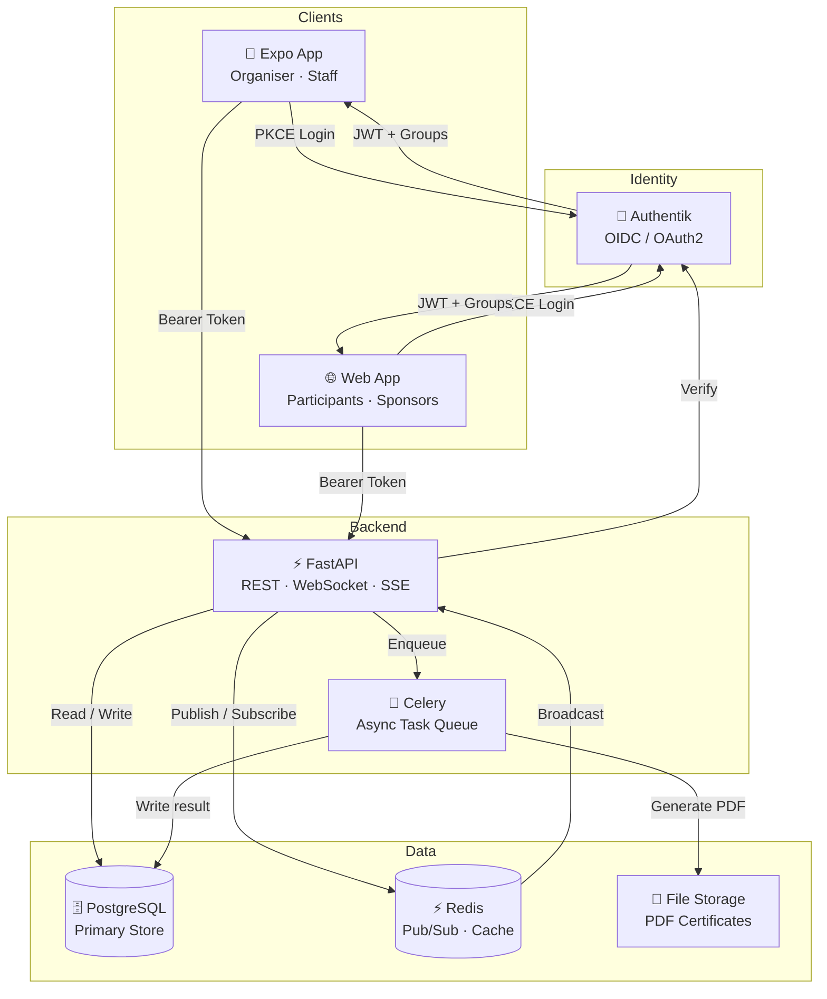
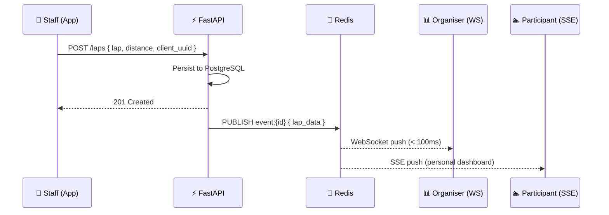
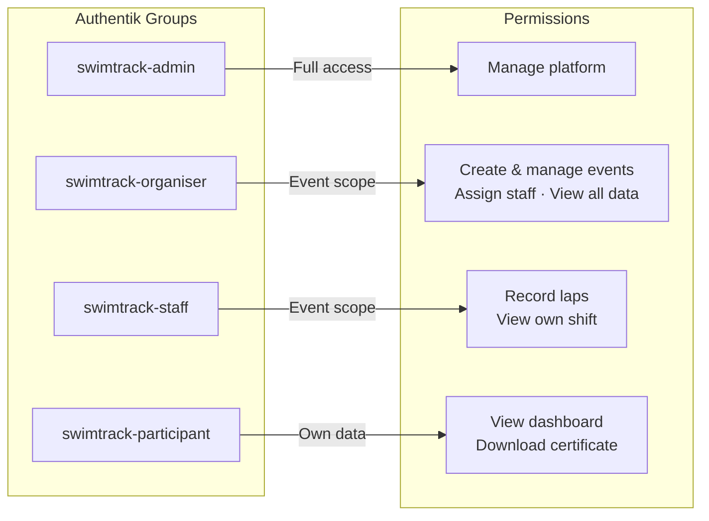
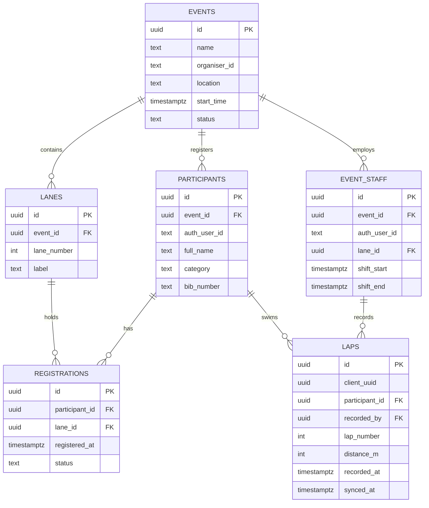

# 🏊 Swimeo

> **The open platform for competitive swimming events.**  
> From event creation to live tracking and automated results – all in one place.

---

## What is Swimeo?

Swimeo is an all-in-one event operations platform for managing competitive long-distance swimming events. It digitises every phase of a swim event: planning, live execution and automated evaluation – replacing paper-based processes with a real-time, role-aware system accessible from any device.

Built for swim clubs, schools, companies and event organisers who need a reliable, transparent and modern solution.

---

## Repositories

| Repository | Description | Stack |
|---|---|---|
| [`lanepilot-app`](https://github.com/) | Mobile & web client for all user roles | Expo · React Native · TypeScript |
| [`lanepilot-api`](https://github.com/) | REST API, WebSocket and SSE backend | Python · FastAPI · PostgreSQL · Redis |

---

## Architecture

---

## Real-time Data Flow

Three parallel channels serve different roles simultaneously.

---

## Role Model

---

## Core Data Model

---

## Key Features

**Event Management**
- Create and configure events with location, timing, sponsors and lane setup
- Define participant categories (school, club, company, private)
- Staff assignment with shift and break scheduling

**Live Execution**
- Real-time lap recording by staff via mobile app
- Offline-capable – laps are stored locally and synced when connectivity returns
- Free lane registration and transfer for participants during the event
- Live organiser dashboard via WebSocket (< 100ms latency)

**Evaluation & Results**
- Automatic ranking by category using PostgreSQL window functions
- Personal dashboards for participants via SSE push
- PDF certificate generation (async, WeasyPrint + Jinja2 templates)
- Exportable result data per event

---

## Tech Stack

| Layer | Technology |
|---|---|
| Mobile & Web | Expo · React Native · TypeScript |
| API | Python 3.12 · FastAPI · Pydantic v2 |
| Auth | Authentik (self-hosted OIDC/OAuth2) |
| Database | PostgreSQL 16 |
| Realtime | Redis 7 (Pub/Sub) |
| Task Queue | Celery |
| PDF | WeasyPrint · Jinja2 |
| Infrastructure | Docker · Docker Compose |

---

## Offline Sync Strategy

Staff members operate in environments with unreliable Wi-Fi (indoor swimming halls). Every lap recorded by a staff member is written immediately to local storage (`expo-sqlite`) with a locally generated `client_uuid`. A background sync queue pushes unsynced records (`synced_at = null`) to the API when connectivity is available. The `client_uuid` unique constraint on the server prevents duplicates in all scenarios.

---

## Project Status

> 🚧 **In active development.** Not yet production-ready.

- [x] Architecture design
- [x] Data model
- [ ] Docker Compose local setup
- [ ] Authentik OIDC integration (Expo PKCE flow)
- [ ] Core API endpoints
- [ ] Expo app scaffolding
- [ ] Real-time WebSocket / SSE layer
- [ ] PDF certificate generation
- [ ] Offline sync queue

---

## License

MIT

